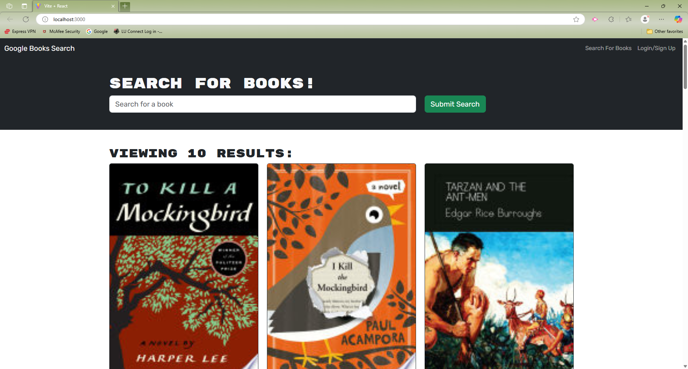

# Book-Research

## Describtion 

This Application was created to research books that the user is interest in and wantd to research on it. By providing information of a book they are interest in helps them out which to pick by using the Graphql to provide specific information in the Database to search on the book and provide information. By creating this application help the user research the book before purchasing in any retail where they sell that book. This application has help me view the fuctionality of a working application and creating a working schema.

## Installation

N/A

## Usage

GitHub Link: https://github.com/Gunther0662/Book-Research

## Credits

N/A

## License

This applaciation is in lincense by MIT License.[https://choosealicense.com/](https://choosealicense.com/).

## Badges

N/A

## Features

N/A

## How to Contribute

N/A

## Tests

N/A